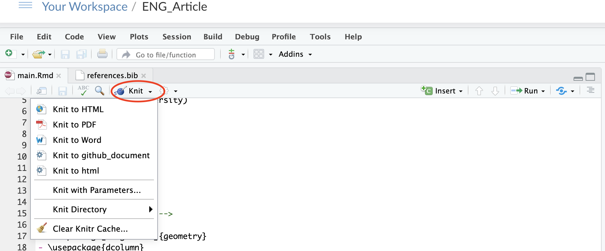

```{r setup, include=FALSE}
knitr::opts_chunk$set(
  echo = TRUE,  warning = FALSE, message = FALSE,
  fig.show = 'hold', fig.align = 'center', fig.pos = 'h',  out.width = "80%"
)

pdf.options(family = "Korea1deb")

library(stringr)
library(dplyr)
library(ggplot2)
library(magrittr)
library(knitr)
library(kableExtra)
library(lubridate)
library(highcharter)
library(quantmod)
```


<br>
<div style="background-color:#a8c3ed;padding: 0px">

> Rmarkdown: 데이터 분석, 표/그림 작성, 설명 작성, 포매팅, 레퍼런스 관리를 
> R에서 한꺼번에 관리하는 방법
> 

</div>

# Rmarkdown이란?

- Rmarkdown은 기존의 데이터 분석 및 리포팅 워크플로우를 획기적으로 개선

```{r echo = FALSE, fig.cap='데이터분석 및 리포팅 워크플로우'}

```

- 기존: 데이터 분석을 하고 리포팅을 하기 위해서는 데이터를 분석하고, 표/그림을 작성하고, 설명을 작성하고, 보기 좋게 포매팅을 하고, 레퍼런스를 관리해야했음

R markdown과 함께라면, 

- 모든 것을 R에서 한꺼번에 통합 관리 및 진행 가능 / 실수 방지
- 이는 재생산 가능한 (reproducible) 연구 및 리포팅을 가능하게 함 
- 데이터 변경에 따른 설명 변경 등을 한꺼번에 해결 가능
- 하나의 Rmd 파일로 아웃풋을 다양한 포맷으로 exporting 가능 (html, docx, pdf 등)

# R markdown 프로세스

- Rmd로 문서를 작성
- knitr 패키지가 R 코드를 실행 한 후 md 파일로 변환
- pandoc 패키지가 md 파일을 HTML, PDF, Word, Presentation 등으로 변환 (컴파일)

```{r echo = FALSE, fig.cap='R markdown 프로세스'}

```

- html로 변환 시에는 크게 필요한 것은 없음
- pdf로 변환 시에는 코드를 pdf로 변환시켜주는 프로그램인 LaTeX이 필요함

LATEX 사용하는 방법

- 첫 번째는 Latex 프로그램을 컴퓨터 로컬에 설치하여 Rstudio에서 직접 컴파일 (https://www.latex-project.org/get/)
- 두 번째는 이미 프로그램이 설치되어 있는 온라인 상에서 컴파일
- 현재 강의 상에서는 Latex 프로그램을 설치하는 것이 시간이 걸리므로, 온라인 상에서 R을 사용하고, 컴파일을 진행함.

# Rstudio Cloud 및 Overleaf 사용법

## Rstudio Cloud

- Rstudio Cloud 주소 (무료): https://rstudio.cloud/
- Rstudio Cloud는 클라우드 컴퓨팅을 이용
- 내 컴퓨터에서는 웹페이지를 통해 코딩만 진행
- Rstudio Cloud 서버 내에 데이터를 저장 컴퓨팅을 진행하는 방식

```{r echo = FALSE, fig.cap='R studio Cloud 메인화면'}

```
- 가입을 진행하면, 개인의 워크스페이스를 얻을 수 있음

```{r echo = FALSE, fig.cap='R studio Cloud 워크스페이스'}

```
- 여기에서 New Project를 클릭

```{r echo = FALSE, fig.cap='R studio Cloud New Project'}

```
- 여기에서 R markdown...으로 표기된 것을 클릭
- 업데이트가 필요하면 자동으로 진행됨 

```{r echo = FALSE, fig.cap='R studio Cloud Compile'}

```

- R cloud 컴파일은 Knit이라는 버튼을 누르면 가능함
- 한글로 진행시 tex 파일을 다운로드하여 Overleaf에서 컴파일 진행

## Overleaf

```{r echo = FALSE, fig.cap='R studio Cloud New Project'}

```

- R studio Cloud는 R studio Cloud 쪽에서 미리 지정해둔 패키지만 사용이 가능함
- 따라서 한글 등의 패키지를 사용할 때에는 마지막 컴파일이 안되는 문제 발생
- 단, 컴파일이 마지막단계에서 안되는 것이므로, 중간 파일을 다운로드하여 온라인 컴파일 시스템인 Overleaf 혹은 로컬 컴퓨터에서 Latex을 다운로드 후 컴파일하면 한글 이용 가능 

Overleaf

- 주소: https://www.overleaf.com/
- 회원가입

# R markdown Cheet sheet

- 주소: https://rstudio.com/wp-content/uploads/2016/02/rmarkdown-cheatsheet-kr.pdf

# 논문 형식

- 미리 세팅해둔 논문형태의 파일을 이용하기 위해 다음 주소로 이동

파일 주소

- 영문: https://github.com/khbae/article_english  
- 한글: https://github.com/khbae/article_korean

- 현재는 편의상 영문을 위주로 진행   
- R Cloud에는 한글 컴파일이 불가 
- 한글로 진행시 Overleaf를 사용하여 다시 컴파일을 진행하여야 함

```{r echo = FALSE, fig.cap='Github Clone'}

```
- 해당 GitHub 페이지에서 Clone or download 버튼을 클릭 후 링크를 복사

```{r echo = FALSE, fig.cap='R studio Cloud Clone'}

```

- Rstudio Cloud에 돌아가서 New project from Git Repo 선택
- 복사한 링크를 입력하고 잠시 기다리면 R studio Cloud에 Workspace가 세팅이 완료

# Reference 구성

- 구글스칼라에서 원하는 문서 검색 

```{r echo = FALSE, fig.cap='Google Scholar Reference'}

```
- 쌍따옴표를 누르고 BibTex 선택하여 복사  
- article.bib 혹은 reference.bib 파일에 붙여넣기

```{r echo = FALSE, fig.cap='Citation'}

```
- 골뱅이 (@) 표시와 함께 라벨을 입력해주면 citation 완료
- 문서 마지막에 "# Reference"를 입력해주면 reference 정리 완료

최종 문서 샘플
- 주소: https://github.com/jkyu126/lecture/rmarkdown/result_sample.pdf

감사합니다.


